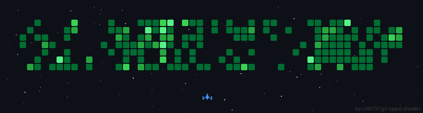

## 🕶️ Welcome to My Cyber Domain! 👾

```ascii
██████╗  ██████╗ ███╗   ███╗███████╗ ██████╗     ███╗   ██╗███████╗██╗    ██╗ ██████╗ 
██╔══██╗██╔═══██╗████╗ ████║██╔════╝██╔═══██╗    ████╗  ██║██╔════╝██║    ██║██╔═══██╗
██████╔╝██║   ██║██╔████╔██║█████╗  ██║   ██║    ██╔██╗ ██║█████╗  ██║ █╗ ██║██║   ██║
██╔══██╗██║   ██║██║╚██╔╝██║██╔══╝  ██║   ██║    ██║╚██╗██║██╔══╝  ██║███╗██║██║   ██║
██║  ██║╚██████╔╝██║ ╚═╝ ██║███████╗╚██████╔╝    ██║ ╚████║███████╗╚███╔███╔╝╚██████╔╝
╚═╝  ╚═╝ ╚═════╝ ╚═╝     ╚═╝╚══════╝ ╚═════╝     ╚═╝  ╚═══╝╚══════╝ ╚══╝╚══╝  ╚═════╝
```


 <p align="left">
  
</p>


<h3 align="left">🛠 Language and tools I've worked with </h3>

###

<div align="left">
  
  
  
  
  
  
  
  
  
  
  
  
  
  
  
  
  
  
  
  
  
  
  
</div>


### 🏆 GitHub Stats & Activity:


---


<table>
  <tr>
    <!-- Left: Terminal GitHub Stats -->
    <td>
      <p align="left">
        
      </p>
    </td>

    <!-- Right: GIF -->
    <td>
      <p align="right">
        
      </p>
    </td>
  </tr>
</table>


<table style="border: none; border-collapse: collapse;">
  <tr style="border: none;">
    <td style="border: none; width: 40%; text-align: center;">
      
    </td>
    <td style="border: none; width: 60%; text-align: left;">
       <strong>Build and deploy Solana programs (Anchor (rust))</strong><br>
       Design and launch SPL tokens<br>
       Work with liquidity pools, mint & freeze authorities<br>
       Building bundlers, snipers and automated programs that support communities on Solana<br>
       Explore on-chain mechanics and real-world use cases
    </td>
  </tr>
</table>





<div align="center">
  
</div>
