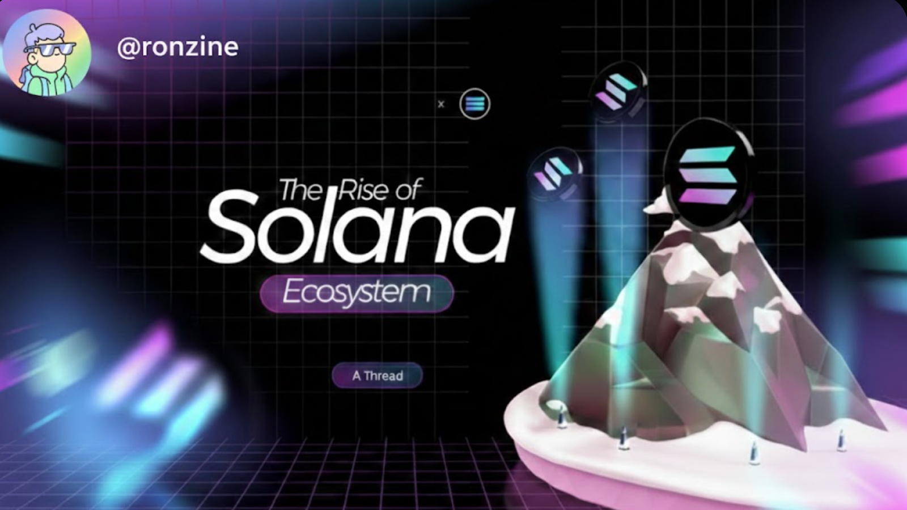

## 🕶️ Welcome to My Cyber Domain! 👾

```ascii
██████╗  ██████╗ ███╗   ███╗███████╗ ██████╗     ███╗   ██╗███████╗██╗    ██╗ ██████╗ 
██╔══██╗██╔═══██╗████╗ ████║██╔════╝██╔═══██╗    ████╗  ██║██╔════╝██║    ██║██╔═══██╗
██████╔╝██║   ██║██╔████╔██║█████╗  ██║   ██║    ██╔██╗ ██║█████╗  ██║ █╗ ██║██║   ██║
██╔══██╗██║   ██║██║╚██╔╝██║██╔══╝  ██║   ██║    ██║╚██╗██║██╔══╝  ██║███╗██║██║   ██║
██║  ██║╚██████╔╝██║ ╚═╝ ██║███████╗╚██████╔╝    ██║ ╚████║███████╗╚███╔███╔╝╚██████╔╝
╚═╝  ╚═╝ ╚═════╝ ╚═╝     ╚═╝╚══════╝ ╚═════╝     ╚═╝  ╚═══╝╚══════╝ ╚══╝╚══╝  ╚═════╝
```

<div align="center">
  
</div>

 <p align="left">
   
</p>

<div align="center">
  
</div>

<h3 align="left">🛠 Language and tools I've worked with </h3>

###

<div align="left">
  
  
  
  
  
  
  
  
  
  
  
  
  
  
  
  
  
  
  
  
  
  
  
  
  
  
  
  
  
  
  
  
  
  
</div>

<div align="center">
  
</div>

### 🏆 GitHub Stats & Activity:


<div align="center">
  
</div>

<table>
  <tr>
    <!-- Left: Typing Animation (Code Simulation) -->
       <td>
     <!-- Sequential Typing Animation for Flask Code -->
<p align="left">
  <!-- Progressive typing animation that builds up the code -->
  
</p>


   
   <td>
      <p align="right">
        
      </p>
    </td>
  </tr>
</table>

<table>
  <tr>
    <!-- Left: SOL Image -->
    <td>
      <p align="left">
        
      </p>
    </td>
    
    <!-- Right: Text Content -->
    <td>
      <p align="right">
        
      </p>
    </td>
  </tr>
</table>

<div align="center">
  
</div>


<div align="center">
  
</div>

<div align="center">
  
</div>
